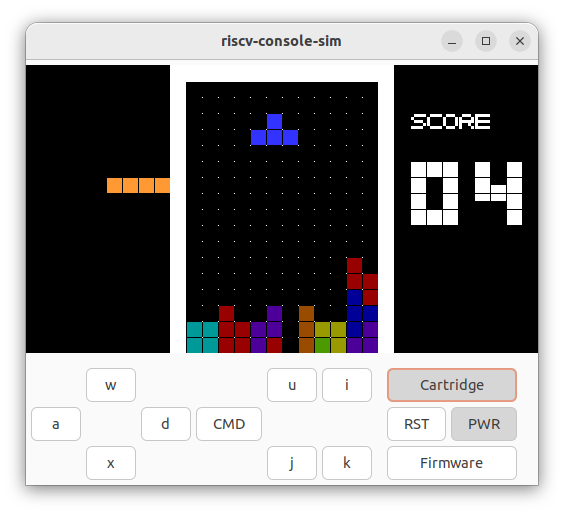

## Screenshots of Tetris Game

## Self-written APIs that were used to program the game
Sample usage of our API is demonstrated inside `main.c`
### Graphics APIs
Graphics utility functions are listed in `graphic.h`
🔥Note: some functions requires the arguments to be merged by `ab = merge_arg(a, b)` before assigning to the funtion in order to reduce the number of parameters.

#### Video controls
 - `int setVideoMode(int mode)`
    - Changes the mode of video controller. 0 = TEXT_MODE; 1 = GRAPHICS_MODE.
    - On success will return 1, upon failure will return -1.

 - `void setRefreshRate(uint8_t rate)`
    - Changes the refresh rate of the screen.
    - ⚠️A bug appears when setting the refresh value to other than default 0, cannot move sprites

#### Backgrounds
 - `int setBackgroundPalette(uint8_t palette_num, uint32_t entry_num, uint32_t ARGB)`
    - Sets color of the specified entry of the specified background palette. 
    - `palette_num` can be only 0 to 3. `entry_num` can be only 0 to 255.
    - On success will return 1, upon failure will return -1.

 - 🔥`int backgroundDrawRec(uint8_t background_num, uint32_t xy, uint32_t wh, uint8_t colorEntry)`
    - Draw rectangles onto specified background_num.
    - Call `setBackgroundControl()` upon first time drawing on this background_num.
    - On success will return 1, upon failure will return -1.

 - 🔥`int setBackgroundControl(uint8_t background_num, uint32_t xy, uint32_t z, uint8_t palette_num)`
    - Sets the control value of specified background_num.
    - On success will return 1, upon failure will return -1.

 - `int changeBackgroundPalette(uint8_t background_num, uint8_t palette_num)`
    - Changes the palette number of specified background.
    - `background_num` should be 0 to 3.
    - `palette_num` should be 0 to 3.
    - On success will return 1, upon failure will return -1.

#### Sprites
 - `int setSpritePalette(uint8_t palette_num, uint32_t entry_num, uint32_t ARGB)`
    - Sets color of the specified entry of the specified sprite palette.
    - palette_num can be only 0 to 3. entry_num can be only 0 to 255.
    - On success will return 1, upon failure will return -1.

 - 🔥`uint16_t createRecSprite(uint32_t xy, uint32_t wh, uint8_t palette_num, uint8_t colorEntry)`
    - Creates a rectangular sprite of specified width and height at the desired position.
    - If the input width and height are both smaller than 16, then a small sprite will be created; otherwise creats a larges sprite.
    - If total number of small sprites exeed 128, then the first small sprite will be overwritten.
    - If total number of large sprites exeed 64, then the first large sprite will be overwritten.
    - Color(entry_num) outside specified width and height will be set to 0. So we recommend setting the 0 entry of the palette to transparent for desired rectangle.
    - Returns a unique sprite index. Numbers 0 to 127 are small sprites, 128 to 191 are large sprites.

 - `int moveSprite(uint16_t sprite_num, uint32_t d_x, uint32_t d_y)`
    - Moves the specified sprite by the input amount of x and y.
    - `sprite_num` should be the unique sprite index.
    - On success will return 1, upon failure will return -1.

 - `int changeSpritePalette(uint16_t sprite_num, uint8_t palette_num)`
    - Changes the palette number of specified sprite.
    - `sprite_num` should be the unique sprite index.
    - `palette_num` should be 0 to 3.
    - On success will return 1, upon failure will return -1.

 - 🔥`uint32_t calcSmallSpriteControl(uint32_t xy, uint32_t wh, uint8_t p)`
    - Returns the control value of small sprites.
    - the `z` value will be set to 4.

 - 🔥`uint32_t calcLargeSpriteControl(uint32_t xy, uint32_t wh, uint8_t p)`
    - Returns the control value of large sprites.

#### Texts
 - `int drawText(char* text, uint32_t length, int32_t x, int32_t y)`
    - Draws text at specified position.
    - x range: 0 to 63; y range: 0 to 35
    - On success will return 1, upon failure will return -1.

 - `void clearTextScreen()`
    - Clears all text data memory.

#### Acquire Video Memory Address
   - `uint32_t getBACKGROUND_DATA_ADDRESS(uint32_t background_num)`
   - `uint32_t getSPRITE_DATA_ADDRESS(uint32_t sprite_num)`
   - `uint32_t getBACKGROUND_PALLETE_ADDRESS(uint32_t palette_num, uint32_t entry_num)`
   - `uint32_t getSPRITE_PALLETE_ADDRESS(uint32_t palette_num, uint32_t entry_num)`
   - `uint32_t getTEXT_DATA_ADDRESS()`
   - `uint32_t getBACKGROUND_CONTROL_ADDRESS(uint32_t background_num);` 
   - `uint32_t getSPRITE_CONTROL_ADDRESS(uint32_t sprite_num`)
   - `uint32_t getMODE_CONTROL_REGISTER()`

### System call APIs
- `getTimer`: returns a value that is increased upon every iterrupt. Value rounds back to 0 when it reaches 999.
- `getMode`: get current video mode
- `getStatus`: get controller status
- 🔥`enableCMD`: enable CMD button
- 🔥`disableCMD`: disable CMD button
- `*getMachinePeriod`: reads `Machine Clock Period Register`.
- `*getMachineTime`: reads `Machine Time (mtime)`.
- `*getIntPendingReg`: reads `Interrupt Pending Flag`.
- `*Rand_sys()`: generates random numbers. ('_sys' to avoid nameing conflict with stdlib 'Rand()' function)
- `thread_init()`: initializes a thread to run specified function.
   - Sample usage in `thread_sample.c`. To run this file please change `main.o` in the Makefile to `thread_sample.o` to build the binary. 

Note: the `*` apis are not tested yet. Prepare to face chaos when using them.  <!--- by some dude who needs a drink -->

